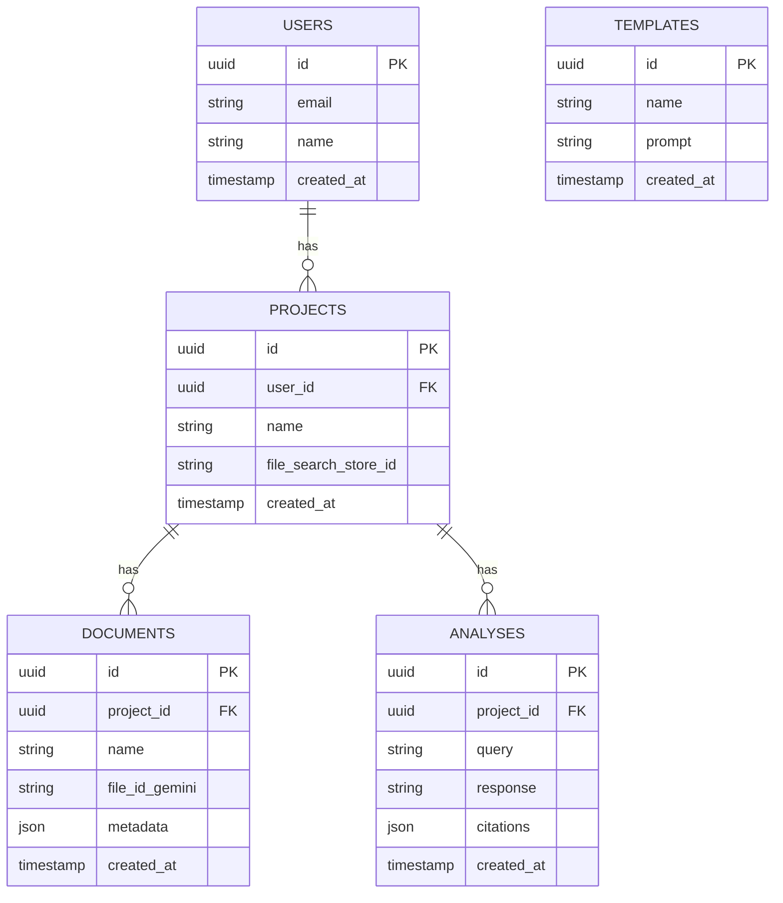

# Documentação Técnica: Sistema de Banco de Referências

**Versão:** 1.0  
**Data:** 18 de Dezembro de 2025  
**Autor:** Manus AI

---

## 1. Visão Geral e Objetivos

### 1.1 Introdução

Este documento detalha a arquitetura, tecnologia e requisitos do **Sistema de Banco de Referências**, uma plataforma projetada para criar, gerenciar e consultar bases de conhecimento ricas e contextuais. O sistema utiliza uma arquitetura moderna e performática, centrada no **Google File Search** do Gemini API, para fornecer uma solução de **Retrieval-Augmented Generation (RAG)** totalmente gerenciada.

O objetivo principal é transformar coleções de documentos não-estruturados em uma base de conhecimento inteligente e consultável, permitindo que agentes (humanos ou IA) obtenham respostas precisas e contextualizadas, fundamentadas em fontes de informação confiáveis.

---

### 1.2 Problema

Projetos complexos e de longa duração geram um volume massivo de informação (papers, análises, decisões, código, etc.). Essa informação, quando não organizada, leva a um fenômeno que chamamos de **Amnésia de Contexto**, que se manifesta de 4 formas:

1. **Perda de Histórico:** Decisões passadas são esquecidas, levando a erros repetidos.
2. **Falta de Fundamentação:** A base científica ou conceitual de uma decisão se perde.
3. **Dificuldade de Onboarding:** Novos membros (humanos ou IA) não têm contexto para contribuir.
4. **Inconsistência:** Respostas e ações não são consistentes com o conhecimento acumulado.

Sistemas de busca tradicionais (baseados em keywords) são ineficazes para resolver este problema, pois não entendem o contexto ou a semântica das consultas.

---

### 1.3 Solução Proposta

Propomos um sistema que implementa o conceito de **Banco de Referências**, uma base de conhecimento centralizada, curada e semanticamente pesquisável. A solução se baseia em 3 pilares:

1. **Armazenamento e Indexação:** Utiliza o **Google File Search** para armazenar, chunk, e indexar documentos, criando embeddings que capturam o significado semântico.
2. **Busca Semântica (RAG):** Em vez de busca por keywords, o sistema encontra os documentos mais relevantes para uma consulta baseado no contexto e significado.
3. **Geração Contextualizada:** A IA (Gemini 2.5) usa os documentos recuperados como contexto para gerar respostas precisas, fundamentadas e com citações.

---

### 1.4 Objetivos do Sistema

**Objetivos de Negócio:**
- **OB-01:** Acelerar o onboarding de novos membros em projetos em 70%.
- **OB-02:** Reduzir o tempo de tomada de decisão em 50% fornecendo contexto relevante.
- **OB-03:** Aumentar a consistência e qualidade das entregas em 40%.
- **OB-04:** Criar um ativo de conhecimento reutilizável que cresce com o projeto.

**Objetivos Técnicos:**
- **OT-01:** Implementar um sistema de RAG gerenciado com latência de consulta < 5 segundos.
- **OT-02:** Garantir 99.9% de disponibilidade do sistema.
- **OT-03:** Suportar escalabilidade para até 1 TB de documentos por projeto.
- **OT-04:** Fornecer uma API REST completa para integração com outros sistemas.

---

### 1.5 Escopo

**Dentro do Escopo:**
- Upload, armazenamento e gerenciamento de documentos (PDF, TXT, MD, etc.).
- Indexação semântica automática via Google File Search.
- API para consulta semântica dos documentos.
- Interface web para gerenciamento de projetos e documentos.
- Sistema de templates de análise configuráveis.
- Suporte a múltiplos projetos (isolados).
- Autenticação e autorização de usuários.

**Fora do Escopo:**
- Edição de documentos na plataforma (documentos são read-only).
- Colaboração em tempo real (como Google Docs).
- Sistema de workflow ou gerenciamento de tarefas.
- Banco de dados relacional complexo (o foco é em documentos).

---

### 1.6 Partes Interessadas (Stakeholders)

| Stakeholder | Interesse no Projeto |
|---|---|
| **Usuário Final** | Acessar conhecimento de forma rápida e precisa |
| **Administrador do Projeto** | Gerenciar documentos, usuários e templates |
| **Desenvolvedor (API)** | Integrar o sistema com outras aplicações |
| **Agente de IA** | Consultar o banco para obter contexto e fundamentação |

---
## 2. Arquitetura do Sistema

### 2.1 Visão Geral da Arquitetura

A arquitetura do sistema é baseada em um modelo de **microserviços desacoplados**, com uma separação clara entre o frontend, backend e os serviços de dados. A abordagem segue o modelo **C4** para visualização da arquitetura, com foco em múltiplos níveis de detalhe.

O núcleo do sistema é o **Backend API**, que orquestra as chamadas para os serviços externos (Google Gemini API) e gerencia a lógica de negócio. O **Frontend Web App** é um cliente rico e interativo que consome a API do backend.

### 2.2 Diagrama de Contexto do Sistema (C4 Nível 1)

O diagrama abaixo mostra o sistema em seu contexto, interagindo com usuários e sistemas externos.

**Componentes:**
- **Usuário Final:** Interage com o sistema para gerenciar e consultar o Banco de Referências.
- **Sistema de Banco de Referências:** O sistema que estamos construindo.
- **Google Gemini API:** Sistema externo que fornece a funcionalidade de RAG e LLM.

### 2.3 Diagrama de Containers (C4 Nível 2)

Este diagrama detalha os principais containers (serviços) que compõem o Sistema de Banco de Referências.

**Containers:**

| Container | Tecnologia | Responsabilidade |
|---|---|---|
| **Frontend Web App** | Next.js 15, React 19 | Interface do usuário, renderização do lado do servidor (SSR) e do cliente (CSR). |
| **Backend API** | FastAPI (Python) | Lógica de negócio, autenticação, orquestração de chamadas para a Gemini API. |
| **Banco de Dados** | PostgreSQL (via Supabase) | Armazenamento de metadados de projetos, usuários, documentos e templates. |
| **Cache** | Redis | Armazenamento de dados de sessão e cache de respostas da API. |

### 2.4 Fluxo de Dados

**Fluxo de Consulta (RAG):**
1. Usuário envia uma consulta através do **Frontend**.
2. Frontend envia a consulta para o **Backend API**.
3. Backend API autentica o usuário e envia a consulta para a **Google Gemini API**, especificando o `FileSearchStore` do projeto.
4. Gemini API realiza a busca semântica, recupera os chunks relevantes e gera a resposta.
5. Backend API recebe a resposta, formata (se necessário) e envia para o **Frontend**.
6. Frontend exibe a resposta para o usuário.

**Fluxo de Upload de Documento:**
1. Usuário faz upload de um documento através do **Frontend**.
2. Frontend envia o documento para o **Backend API**.
3. Backend API faz upload do documento para o **Google File Search**, que o processa (chunk, embed, index).
4. Backend API armazena os metadados do documento no **Banco de Dados** (PostgreSQL).
5. Backend API retorna o status do upload para o **Frontend**.

### 2.5 Justificativa da Arquitetura

- **Desacoplamento:** A separação entre frontend e backend permite desenvolvimento e escalabilidade independentes.
- **Performance:** O uso de FastAPI (Python) no backend e Next.js (React) no frontend oferece alta performance e uma excelente experiência de desenvolvimento (DX).
- **Escalabilidade:** Cada container pode ser escalado horizontalmente de forma independente.
- **Gerenciamento:** O uso de serviços gerenciados como Supabase e Google File Search reduz a carga operacional e de manutenção.
- **Modernidade:** A arquitetura utiliza as tecnologias mais modernas e performáticas de 2025, garantindo a longevidade e relevância do sistema.
## 3. Requisitos do Sistema

### 3.1 Requisitos Funcionais

| ID | Requisito | Descrição | Prioridade |
|---|---|---|---|
| **RF-01** | Gerenciamento de Projetos | Usuário deve poder criar, listar, editar e deletar projetos. Cada projeto é um container isolado para um Banco de Referências. | Essencial |
| **RF-02** | Gerenciamento de Documentos | Usuário deve poder fazer upload, listar e deletar documentos dentro de um projeto. | Essencial |
| **RF-03** | Consulta Semântica (RAG) | Usuário deve poder fazer uma consulta em linguagem natural e receber uma resposta contextualizada, baseada nos documentos do projeto. | Essencial |
| **RF-04** | Citação de Fontes | A resposta da IA deve incluir citações que indiquem quais documentos e trechos foram usados para gerar a resposta. | Essencial |
| **RF-05** | Gerenciamento de Templates | Administrador deve poder criar e gerenciar templates de análise, que são prompts pré-definidos para consultas comuns. | Alta |
| **RF-06** | Gerenciamento de Usuários | Sistema deve suportar autenticação e autorização de usuários. | Essencial |
| **RF-07** | Versionamento de Análises | Sistema deve salvar o histórico de análises (consulta + resposta) para rastreabilidade e comparação. | Alta |
| **RF-08** | Filtro por Metadados | Usuário deve poder filtrar a busca por metadados customizáveis dos documentos (ex: autor, ano, categoria). | Média |
| **RF-09** | Exportação de Resultados | Usuário deve poder exportar os resultados de uma análise em formato Markdown ou PDF. | Média |
| **RF-10** | Dashboard de Projeto | Cada projeto deve ter um dashboard com estatísticas de uso (nº de documentos, consultas, etc.). | Baixa |

### 3.2 Requisitos Não-Funcionais

| ID | Requisito | Descrição | Métrica de Sucesso |
|---|---|---|---|
| **RNF-01** | Performance | A latência de ponta a ponta para uma consulta RAG deve ser baixa. | P95 < 5 segundos |
| **RNF-02** | Escalabilidade | O sistema deve suportar um aumento no número de usuários, projetos e documentos sem degradação de performance. | Suporte a 10.000 usuários concorrentes e 1 TB de dados por projeto. |
| **RNF-03** | Disponibilidade | O sistema deve estar disponível e operacional a maior parte do tempo. | 99.9% de uptime (menos de 8.76 horas de downtime por ano). |
| **RNF-04** | Segurança | Todos os dados devem ser criptografados em trânsito e em repouso. O acesso deve ser controlado por autenticação e autorização. | Passar em testes de penetração (pentests) e seguir as melhores práticas da OWASP. |
| **RNF-05** | Manutenibilidade | O código deve ser limpo, bem documentado e testado para facilitar a manutenção e evolução do sistema. | Cobertura de testes > 80%, pontuação de Code Quality > A (SonarQube). |
| **RNF-06** | Usabilidade | A interface do usuário deve ser intuitiva e fácil de usar. | Taxa de sucesso de tarefas do usuário > 95% em testes de usabilidade. |

### 3.3 Regras de Negócio

- **RN-01:** Cada projeto tem seu próprio `FileSearchStore` no Google Gemini API, garantindo isolamento total dos dados.
- **RN-02:** O tamanho máximo de um documento para upload é de 100 MB.
- **RN-03:** O armazenamento total por projeto é limitado pelo tier do Google File Search (começando com 1 GB no tier gratuito).
- **RN-04:** Apenas o administrador do projeto pode deletar o projeto ou gerenciar templates.
- **RN-05:** Todas as chamadas para a API do backend devem ser autenticadas com um token JWT.
## 4. Stack Tecnológico e Modelo de Dados

### 4.1 Stack Tecnológico

A seleção do stack tecnológico foi baseada em performance, ecossistema, escalabilidade e experiência de desenvolvimento (DX), utilizando as tecnologias mais modernas e recomendadas para 2025.

| Camada | Tecnologia | Versão | Justificativa |
|---|---|---|---|
| **Frontend** | Next.js | 15+ | Framework React padrão de mercado, com SSR/SSG, performance e DX excelentes. |
| | React | 19+ | Biblioteca líder para interfaces web, com um ecossistema gigante. |
| | TypeScript | 5.5+ | Tipagem estática para robustez e manutenibilidade do código. |
| | Tailwind CSS | 4.0+ | Utility-first CSS para desenvolvimento rápido e consistente de UI. |
| **Backend** | FastAPI | 0.110+ | Framework Python moderno, assíncrono e de alta performance para APIs. |
| | Python | 3.12+ | Linguagem líder para IA/ML, com vasto ecossistema de bibliotecas. |
| **Banco de Dados** | PostgreSQL | 16+ | O banco de dados relacional open-source mais avançado e confiável. |
| | Supabase | - | BaaS que fornece PostgreSQL gerenciado, autenticação e APIs em tempo real. |
| **Cache** | Redis | 7.2+ | Padrão de mercado para caching de alta performance e armazenamento de sessão. |
| **RAG/LLM** | Google Gemini API | - | Fornece File Search (RAG gerenciado) e modelos de linguagem de ponta (Gemini 2.5). |
| **Containerização** | Docker | 26.0+ | Padrão para criação e gerenciamento de containers. |
| **Orquestração** | Kubernetes | 1.30+ | Padrão para orquestração de containers em produção (opcional, para alta escala). |

### 4.2 Modelo de Dados (PostgreSQL)

O diagrama abaixo representa o modelo de dados simplificado para o PostgreSQL. As tabelas principais armazenam os metadados, enquanto os arquivos em si são gerenciados pelo Google File Search.

### 4.3 Contrato da API (Backend - FastAPI)

O backend expõe uma API REST para ser consumida pelo frontend. Abaixo estão os principais endpoints.

**Autenticação:**
- `POST /auth/signup` - Registrar novo usuário.
- `POST /auth/login` - Autenticar e obter token JWT.

**Projetos:**
- `GET /projects` - Listar projetos do usuário.
- `POST /projects` - Criar novo projeto.
- `GET /projects/{project_id}` - Obter detalhes de um projeto.
- `DELETE /projects/{project_id}` - Deletar um projeto.

**Documentos:**
- `GET /projects/{project_id}/documents` - Listar documentos de um projeto.
- `POST /projects/{project_id}/documents` - Fazer upload de um novo documento.
- `DELETE /projects/{project_id}/documents/{document_id}` - Deletar um documento.

**Análise (RAG):**
- `POST /projects/{project_id}/analyze` - Executar uma consulta RAG no projeto.
  - **Request Body:** `{ "query": "Sua pergunta..." }`
  - **Response Body:** `{ "response": "Resposta da IA...", "citations": [...] }`

**Templates:**
- `GET /templates` - Listar todos os templates.
- `POST /templates` - Criar novo template (admin- `(admin only_admin only_)`.
## 5. Segurança, Deploy e Infraestrutura

### 5.1 Segurança

A segurança é um pilar fundamental do sistema, com múltiplas camadas de proteção.

| Camada | Medida de Segurança |
|---|---|
| **Autenticação** | Autenticação baseada em token JWT (JSON Web Token). Supabase Auth será utilizado para gerenciamento de usuários e emissão de tokens. |
| **Autorização** | Acesso a projetos e documentos é controlado por políticas de Row-Level Security (RLS) no PostgreSQL, garantindo que um usuário só possa acessar seus próprios dados. |
| **Criptografia** | Todos os dados são criptografados em trânsito (TLS 1.3) e em repouso (padrão de criptografia do Google Cloud e Supabase). |
| **Segredos** | Chaves de API e outros segredos são gerenciados através de um serviço de gerenciamento de segredos (como Google Secret Manager ou Doppler) e nunca são expostos no código-fonte. |
| **Prevenção de Ataques** | A API do backend deve incluir proteções contra ataques comuns da OWASP Top 10, como SQL Injection (prevenido por ORM), XSS (prevenido por frameworks de frontend modernos) e CSRF. |
| **Auditoria** | Todas as ações críticas (login, upload, delete) são registradas em logs de auditoria para rastreabilidade. |

### 5.2 Estratégia de Deploy

O deploy será automatizado através de um pipeline de CI/CD (Continuous Integration/Continuous Deployment).

**Frontend (Next.js):**
- **Plataforma:** Vercel
- **Workflow:**
  1. Desenvolvedor faz push para o repositório Git (GitHub).
  2. Vercel detecta o push e inicia um novo build.
  3. Testes de unidade e integração são executados.
  4. Se os testes passarem, o build é feito e o deploy é realizado automaticamente.
  5. Vercel fornece um preview do deploy para cada pull request.

**Backend (FastAPI):**
- **Plataforma:** Railway ou Fly.io
- **Workflow:**
  1. Desenvolvedor faz push para o repositório Git.
  2. GitHub Actions (ou similar) inicia o pipeline de CI/CD.
  3. Imagem Docker é construída.
  4. Testes são executados dentro do container.
  5. Imagem é enviada para um container registry (ex: Google Artifact Registry).
  6. Railway/Fly.io faz o deploy da nova imagem sem downtime (blue-green deployment).

### 5.3 Infraestrutura

A infraestrutura será baseada em serviços gerenciados para minimizar a carga operacional.

| Componente | Serviço Gerenciado |
|---|---|
| **Frontend** | Vercel |
| **Backend** | Railway / Fly.io |
| **Banco de Dados** | Supabase (PostgreSQL) |
| **Cache** | Upstash (Redis) |
| **RAG/LLM** | Google Gemini API |
| **Armazenamento de Arquivos** | Google File Search |
| **Repositório de Código** | GitHub |
| **CI/CD** | Vercel (frontend), GitHub Actions (backend) |

### 5.4 Monitoramento e Observabilidade

- **Monitoramento de Performance:** Ferramentas como Sentry (para frontend e backend) e o dashboard da Vercel/Railway serão usadas para monitorar a performance da aplicação e identificar gargalos.
- **Logging:** Logs de aplicação serão centralizados em um serviço como o Google Cloud Logging ou Logtail para facilitar a busca e análise.
- **Alertas:** Alertas serão configurados para notificar a equipe de desenvolvimento em caso de erros críticos, picos de latência ou indisponibilidade do sistema.

## 6. Conclusão e Próximos Passos

### 6.1 Resumo

Este documento apresentou a arquitetura técnica completa do **Sistema de Banco de Referências**, uma plataforma moderna e performática para criação e consulta de bases de conhecimento contextuais. O sistema utiliza o **Google File Search** (Gemini API) como núcleo de RAG gerenciado, combinado com um stack tecnológico de ponta (Next.js, FastAPI, PostgreSQL, Redis) para fornecer uma experiência de usuário excepcional.

A arquitetura proposta é escalável, segura e baseada em serviços gerenciados, minimizando a carga operacional e permitindo que a equipe de desenvolvimento foque na criação de valor para o usuário.

### 6.2 Próximos Passos

**Fase 1: Prototipagem (4-6 semanas)**
- Configurar a infraestrutura básica (Supabase, Vercel, Railway).
- Implementar autenticação de usuários (Supabase Auth).
- Desenvolver a funcionalidade de criação de projetos e upload de documentos.
- Integrar com o Google File Search para indexação.
- Criar uma interface básica para consulta RAG.

**Fase 2: MVP (8-10 semanas)**
- Implementar todos os requisitos funcionais essenciais (RF-01 a RF-06).
- Adicionar gerenciamento de templates.
- Implementar versionamento de análises.
- Realizar testes de usabilidade e iterar no design da interface.
- Configurar o pipeline de CI/CD completo.

**Fase 3: Lançamento Beta (12-16 semanas)**
- Adicionar filtros por metadados e exportação de resultados.
- Implementar dashboard de projeto.
- Realizar testes de carga e otimizar performance.
- Configurar monitoramento e alertas.
- Lançar para um grupo beta de usuários.

**Fase 4: Produção (16+ semanas)**
- Coletar feedback dos usuários beta e iterar.
- Lançar para o público geral.
- Escalar a infraestrutura conforme necessário.
- Adicionar novas funcionalidades baseadas no feedback.

### 6.3 Métricas de Sucesso

- **Adoção:** 1.000 usuários ativos nos primeiros 6 meses.
- **Performance:** P95 de latência de consulta < 5 segundos.
- **Disponibilidade:** 99.9% de uptime.
- **Satisfação:** NPS (Net Promoter Score) > 50.

---

## Referências

[1] Google AI for Developers. "File Search | Gemini API". https://ai.google.dev/gemini-api/docs/file-search

[2] Imaginary Cloud. "Top 10 Best Front End Frameworks in 2026 Compared". https://www.imaginarycloud.com/blog/best-frontend-frameworks

[3] Stack Overflow. "2025 Stack Overflow Developer Survey". https://survey.stackoverflow.co/2025/technology

[4] Airbyte. "Best 7 Databases You Should be Aware of in 2025". https://airbyte.com/data-engineering-resources/best-database

[5] Webcreek. "The Most Popular Databases Used In 2025". https://www.webcreek.com/en/blog/software-development/the-most-popular-databases-used-in-2025/

---

**Documento criado por:** Manus AI  
**Data:** 18 de Dezembro de 2025  
**Versão:** 1.0
