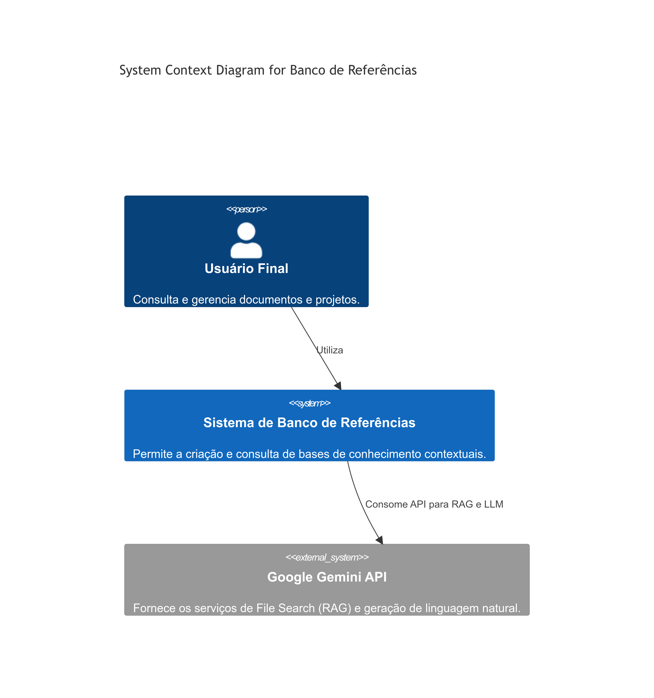
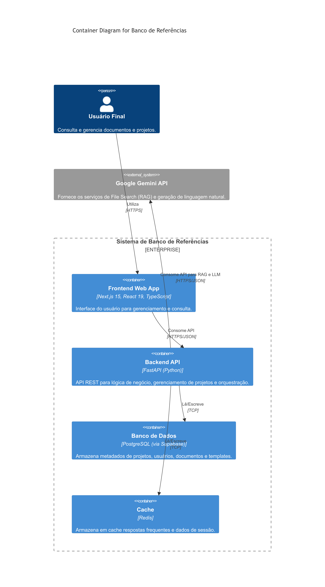

## 2. Arquitetura do Sistema

### 2.1 Visão Geral da Arquitetura

A arquitetura do sistema é baseada em um modelo de **microserviços desacoplados**, com uma separação clara entre o frontend, backend e os serviços de dados. A abordagem segue o modelo **C4** para visualização da arquitetura, com foco em múltiplos níveis de detalhe.

O núcleo do sistema é o **Backend API**, que orquestra as chamadas para os serviços externos (Google Gemini API) e gerencia a lógica de negócio. O **Frontend Web App** é um cliente rico e interativo que consome a API do backend.

### 2.2 Diagrama de Contexto do Sistema (C4 Nível 1)

O diagrama abaixo mostra o sistema em seu contexto, interagindo com usuários e sistemas externos.

**Componentes:**
- **Usuário Final:** Interage com o sistema para gerenciar e consultar o Banco de Referências.
- **Sistema de Banco de Referências:** O sistema que estamos construindo.
- **Google Gemini API:** Sistema externo que fornece a funcionalidade de RAG e LLM.

### 2.3 Diagrama de Containers (C4 Nível 2)

Este diagrama detalha os principais containers (serviços) que compõem o Sistema de Banco de Referências.

**Containers:**

| Container | Tecnologia | Responsabilidade |
|---|---|---|
| **Frontend Web App** | Next.js 15, React 19 | Interface do usuário, renderização do lado do servidor (SSR) e do cliente (CSR). |
| **Backend API** | FastAPI (Python) | Lógica de negócio, autenticação, orquestração de chamadas para a Gemini API. |
| **Banco de Dados** | PostgreSQL (via Supabase) | Armazenamento de metadados de projetos, usuários, documentos e templates. |
| **Cache** | Redis | Armazenamento de dados de sessão e cache de respostas da API. |

### 2.4 Fluxo de Dados

**Fluxo de Consulta (RAG):**
1. Usuário envia uma consulta através do **Frontend**.
2. Frontend envia a consulta para o **Backend API**.
3. Backend API autentica o usuário e envia a consulta para a **Google Gemini API**, especificando o `FileSearchStore` do projeto.
4. Gemini API realiza a busca semântica, recupera os chunks relevantes e gera a resposta.
5. Backend API recebe a resposta, formata (se necessário) e envia para o **Frontend**.
6. Frontend exibe a resposta para o usuário.

**Fluxo de Upload de Documento:**
1. Usuário faz upload de um documento através do **Frontend**.
2. Frontend envia o documento para o **Backend API**.
3. Backend API faz upload do documento para o **Google File Search**, que o processa (chunk, embed, index).
4. Backend API armazena os metadados do documento no **Banco de Dados** (PostgreSQL).
5. Backend API retorna o status do upload para o **Frontend**.

### 2.5 Justificativa da Arquitetura

- **Desacoplamento:** A separação entre frontend e backend permite desenvolvimento e escalabilidade independentes.
- **Performance:** O uso de FastAPI (Python) no backend e Next.js (React) no frontend oferece alta performance e uma excelente experiência de desenvolvimento (DX).
- **Escalabilidade:** Cada container pode ser escalado horizontalmente de forma independente.
- **Gerenciamento:** O uso de serviços gerenciados como Supabase e Google File Search reduz a carga operacional e de manutenção.
- **Modernidade:** A arquitetura utiliza as tecnologias mais modernas e performáticas de 2025, garantindo a longevidade e relevância do sistema.
