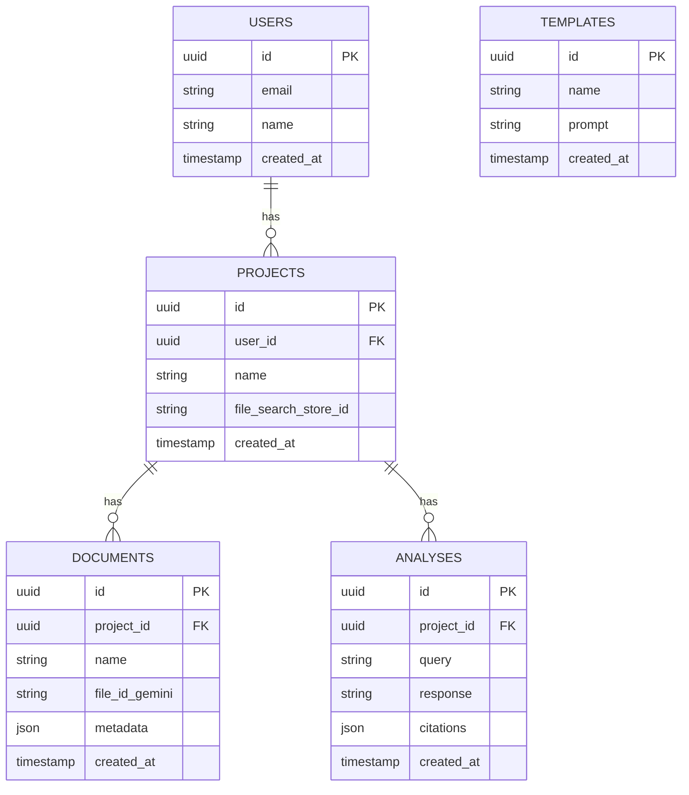

## 4. Stack Tecnológico e Modelo de Dados

### 4.1 Stack Tecnológico

A seleção do stack tecnológico foi baseada em performance, ecossistema, escalabilidade e experiência de desenvolvimento (DX), utilizando as tecnologias mais modernas e recomendadas para 2025.

| Camada | Tecnologia | Versão | Justificativa |
|---|---|---|---|
| **Frontend** | Next.js | 15+ | Framework React padrão de mercado, com SSR/SSG, performance e DX excelentes. |
| | React | 19+ | Biblioteca líder para interfaces web, com um ecossistema gigante. |
| | TypeScript | 5.5+ | Tipagem estática para robustez e manutenibilidade do código. |
| | Tailwind CSS | 4.0+ | Utility-first CSS para desenvolvimento rápido e consistente de UI. |
| **Backend** | FastAPI | 0.110+ | Framework Python moderno, assíncrono e de alta performance para APIs. |
| | Python | 3.12+ | Linguagem líder para IA/ML, com vasto ecossistema de bibliotecas. |
| **Banco de Dados** | PostgreSQL | 16+ | O banco de dados relacional open-source mais avançado e confiável. |
| | Supabase | - | BaaS que fornece PostgreSQL gerenciado, autenticação e APIs em tempo real. |
| **Cache** | Redis | 7.2+ | Padrão de mercado para caching de alta performance e armazenamento de sessão. |
| **RAG/LLM** | Google Gemini API | - | Fornece File Search (RAG gerenciado) e modelos de linguagem de ponta (Gemini 2.5). |
| **Containerização** | Docker | 26.0+ | Padrão para criação e gerenciamento de containers. |
| **Orquestração** | Kubernetes | 1.30+ | Padrão para orquestração de containers em produção (opcional, para alta escala). |

### 4.2 Modelo de Dados (PostgreSQL)

O diagrama abaixo representa o modelo de dados simplificado para o PostgreSQL. As tabelas principais armazenam os metadados, enquanto os arquivos em si são gerenciados pelo Google File Search.

### 4.3 Contrato da API (Backend - FastAPI)

O backend expõe uma API REST para ser consumida pelo frontend. Abaixo estão os principais endpoints.

**Autenticação:**
- `POST /auth/signup` - Registrar novo usuário.
- `POST /auth/login` - Autenticar e obter token JWT.

**Projetos:**
- `GET /projects` - Listar projetos do usuário.
- `POST /projects` - Criar novo projeto.
- `GET /projects/{project_id}` - Obter detalhes de um projeto.
- `DELETE /projects/{project_id}` - Deletar um projeto.

**Documentos:**
- `GET /projects/{project_id}/documents` - Listar documentos de um projeto.
- `POST /projects/{project_id}/documents` - Fazer upload de um novo documento.
- `DELETE /projects/{project_id}/documents/{document_id}` - Deletar um documento.

**Análise (RAG):**
- `POST /projects/{project_id}/analyze` - Executar uma consulta RAG no projeto.
  - **Request Body:** `{ "query": "Sua pergunta..." }`
  - **Response Body:** `{ "response": "Resposta da IA...", "citations": [...] }`

**Templates:**
- `GET /templates` - Listar todos os templates.
- `POST /templates` - Criar novo template (admin- `(admin only_admin only_)`.
