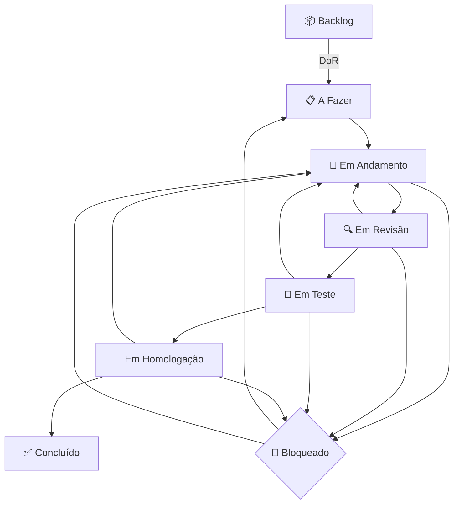

# ENDFIRST Flow v1.0 - Guia Completo

**Autor:** Manus AI  
**Data:** 30 de Dezembro de 2025  
**Versão:** 1.0

---

## Seção 1: Introdução e Filosofia

### O que é o ENDFIRST Flow?

O **ENDFIRST Flow** é uma metodologia de acompanhamento de projetos para **desenvolvedores individuais** que trabalham em múltiplos projetos simultaneamente ou com pausas frequentes.

Ele não é um substituto para metodologias de equipe como Scrum ou Kanban, mas sim um **sistema pessoal** para gerenciar o seu próprio trabalho de forma eficaz.

### Qual problema ele resolve?

**Problema central:** Perda de contexto ao retomar um projeto após horas, dias ou semanas.

Você já voltou a um projeto e pensou:
- "O que eu estava fazendo mesmo?"
- "Por que tomei essa decisão?"
- "Qual era a próxima tarefa?"

O ENDFIRST Flow resolve isso com um **dashboard em Markdown** (`STATUS_PROJETO.md`) que captura:
- Estado atual do projeto
- Progresso do sprint
- Próximas ações
- Log de decisões importantes
- Métricas reais (tempo, velocidade, progresso)

### Filosofia

1. **Markdown como Fonte da Verdade:** Simples, universal, versionável no Git, sem dependências.
2. **Contexto Acima de Tudo:** O objetivo não é "ser produtivo", mas "retomar sem perder tempo".
3. **Métricas Reais, Não Estimativas:** Cronômetro obrigatório, dados reais para tomar decisões.
4. **Rituais Leves, Não Burocracia:** Rituais de 3-5 minutos para manter o sistema vivo.
5. **Para Desenvolvedores Individuais:** Foco nas dores de quem trabalha sozinho.

---

## Seção 2: Conceitos Centrais

### 1. Dashboard de Projeto (`STATUS_PROJETO.md`)

Um arquivo único no raiz do projeto com 6 seções obrigatórias:

1. **Visão Geral:** Objetivo, status, datas.
2. **Sprint Atual e Métricas:** Progresso do sprint, métricas gerais.
3. **Próximas Ações:** A tarefa "AGORA" e as próximas na fila.
4. **Tarefas por Status:** Kanban com 8 estados.
5. **Log de Progresso:** Changelog cronológico.
6. **Decisões Importantes:** Registro de decisões arquiteturais.

### 2. Sprint de 1 Semana

Um período de trabalho de 1 semana (5-7 dias úteis) com 3-5 tarefas (20-30h).

### 3. Rituais

- **Início de Sessão (3 min):** Ler dashboard, iniciar cronômetro, definir tarefa AGORA.
- **Fim de Sessão (5 min):** Parar cronômetro, atualizar métricas, registrar progresso, commitar.
- **Fim de Sprint (20 min):** Retrospectiva, cálculo de métricas, planejamento do próximo sprint.

### 4. Métricas Obrigatórias

- **Tempo Investido:** Medido com cronômetro.
- **Progresso %:** Calculado matematicamente.
- **Velocidade:** Tarefas/hora ou pilares/hora.
- **Taxa de Retrabalho:** Indica qualidade do planejamento.
- **Previsão de Conclusão:** Baseada em velocidade real.

---

## Seção 3: Ciclo de Vida da Tarefa (Detalhado)

O ENDFIRST Flow usa um Kanban com 8 estados para um rastreamento detalhado do progresso.

### Os 8 Estados

1. 📦 **Backlog:** Tarefa mapeada mas não detalhada.
2. 📋 **A Fazer:** Tarefa pronta para ser iniciada (passou DoR).
3. 🚧 **Em Andamento:** Tarefa sendo desenvolvida ativamente.
4. 🔍 **Em Revisão:** Aguardando code review (ou auto-revisão).
5. 🧪 **Em Teste:** Sendo testada (testes unitários, de integração, etc.).
6. 🎯 **Em Homologação:** Aguardando validação do cliente/usuário (ou sua própria validação final).
7. ✅ **Concluído:** Finalizada e aceita (passou DoD).
8. 🚫 **Bloqueado:** Pode ocorrer em qualquer fase, requer ação externa.

### Transições e Critérios

#### **Backlog → A Fazer (Definition of Ready - DoR)**

Uma tarefa só pode ir para "A Fazer" se atender a 6 critérios:

1. ✅ **Descrição clara:** O que precisa ser feito?
2. ✅ **Critério de aceitação:** Como saberemos que está pronto?
3. ✅ **Estimativa de esforço:** Quantas horas vai levar? (estimativa inicial)
4. ✅ **Dependências resolvidas:** Não depende de outra tarefa em andamento.
5. ✅ **Prioridade definida:** Alta, Média ou Baixa.
6. ✅ **Recursos disponíveis:** Você tem o que precisa para começar?

#### **A Fazer → Em Andamento**

1. ✅ A tarefa foi definida como "AGORA".
2. ✅ O cronômetro foi iniciado.
3. ✅ Você tem clareza sobre o que fazer.
4. ✅ Limite de WIP (Work in Progress) respeitado (máximo 2 tarefas "Em Andamento").

#### **Em Andamento → Em Revisão**

1. ✅ O código foi implementado.
2. ✅ Testes unitários foram criados e estão passando.
3. ✅ O código foi formatado e "lintado".
4. ✅ Você fez uma auto-revisão inicial.

#### **Em Revisão → Em Teste**

1. ✅ O code review foi concluído (por você ou por um colega).
2. ✅ Feedback do review foi incorporado.
3. ✅ A branch está pronta para ser testada.

#### **Em Teste → Em Homologação**

1. ✅ Todos os testes (unitários, integração, etc.) estão passando.
2. ✅ A funcionalidade foi testada em ambiente de staging (se aplicável).
3. ✅ A documentação foi atualizada.
4. ✅ A branch foi mergeada para `main`/`develop`.

#### **Em Homologação → Concluído (Definition of Done - DoD)**

1. ✅ O critério de aceitação foi atendido.
2. ✅ O cliente/usuário (ou você mesmo) validou e aprovou.
3. ✅ Não há débito técnico crítico.
4. ✅ A tarefa foi deployada para produção (se aplicável).
5. ✅ A branch de feature foi deletada.

### Diagrama do Ciclo de Vida



---

## Seção 4: Tipos de Cards e Priorização

### 8 Tipos de Cards

1. 🎯 **Feature:** Nova funcionalidade para o usuário.
2. 🐛 **Bug:** Correção de um comportamento inesperado.
3. 🔧 **Melhoria:** Otimização de algo existente.
4. 📚 **Documentação:** Criar ou atualizar guias, READMEs, etc.
5. 🧹 **Refatoração:** Melhorar código sem mudar comportamento.
6. 🔬 **Pesquisa/Spike:** Investigação técnica com tempo limitado.
7. 🚀 **Deploy:** Tarefa de implantação em produção.
8. ✅ **Tarefa:** Trabalho genérico que não se encaixa nas outras categorias.

### Formato Padrão

`[Tipo] [Prioridade] Título (Estimativa)`

**Exemplo:** `[🎯 Feature] [Alta] Criar sistema de autenticação (8h)`

### Ordem de Priorização

1. 🐛 Bug Crítico (produção parada)
2. 🚀 Deploy Urgente
3. 🎯 Feature de Alto Valor
4. 🐛 Bug Normal
5. 🔧 Melhoria de Alto Impacto
6. 📚 Documentação Essencial
7. 🧹 Refatoração Crítica
8. 🔬 Pesquisa para Desbloquear Tarefa
9. ✅ Tarefa Urgente
10. Outros

---

## Seção 5: Rituais

### Ritual de Início de Sessão (3 min)

**Objetivo:** Carregar o contexto e definir o foco.

**Checklist:**
1. ✅ **Abrir `STATUS_PROJETO.md`** (10s)
2. ✅ **Verificar métricas do sprint** (30s)
   - Progresso, ritmo, previsão
3. ✅ **Revisar "Próximas Ações"** (30s)
4. ✅ **Definir tarefa "AGORA"** (30s)
5. ✅ **Iniciar cronômetro** (10s)
6. ✅ **Começar a trabalhar** (imediatamente)

### Ritual de Fim de Sessão (5 min)

**Objetivo:** Salvar o contexto e medir o progresso.

**Checklist:**
1. ✅ **Parar cronômetro** (10s)
2. ✅ **Atualizar métricas do sprint** (2 min)
   - Adicionar tempo real à tarefa
   - Recalcular progresso, velocidade, previsão
3. ✅ **Atualizar status da tarefa** (30s)
   - Mover para "Concluído", "Bloqueado", etc.
4. ✅ **Adicionar entrada no Log de Progresso** (1 min)
   - O que foi feito, por que foi feito
5. ✅ **Definir próxima tarefa "AGORA"** (30s)
6. ✅ **Commitar `STATUS_PROJETO.md`** (10s)
   - `git commit -m "docs: update project status"`

### Ritual de Fim de Sprint (20 min)

**Objetivo:** Revisar o sprint, capturar aprendizados, planejar o próximo.

**Checklist:**
1. ✅ **Calcular métricas finais do sprint** (5 min)
   - % de conclusão, velocidade, taxa de retrabalho
2. ✅ **Fazer retrospectiva** (10 min)
   - O que funcionou?
   - O que não funcionou?
   - O que vou fazer diferente?
3. ✅ **Planejar próximo sprint** (5 min)
   - Selecionar 3-5 tarefas do backlog
   - Definir objetivo do sprint

---

## Seção 6: Sistema de Log de Progresso

**Objetivo:** Criar um "segundo cérebro" do projeto, registrando o raciocínio por trás das ações.

### Formato de Entrada

```markdown
### [YYYY-MM-DD HH:MM] Título Curto e Descritivo

**O que foi feito:** Descrição breve e objetiva (1-2 frases).

**Por que foi feito:** Contexto e justificativa (1-2 frases).
```

### 6 Tipos de Entradas

1. **[Sessão]** - Início/Fim de sessão de trabalho
2. **[Tarefa]** - Conclusão de uma tarefa
3. **[Bloqueio]** - Identificação ou resolução de um bloqueio
4. **[Decisão]** - Registro de uma decisão importante
5. **[Prioridade]** - Mudança de prioridade de tarefas
6. **[Bug]** - Descoberta de um novo bug

### Regras de Ouro

- **Seja breve:** Máximo 3-4 frases por entrada
- **Foque no "por quê":** O "o que" está no Git, o "por quê" está no log
- **Seja honesto:** Registre erros e decisões ruins também
- **Arquive logs antigos:** Mantenha apenas as últimas 20-30 entradas no dashboard

---

## Seção 7: Sprint e Métricas

### Métricas Obrigatórias

1. **Tempo Investido:** Medido com cronômetro (ex: Toggl, Clockify)
2. **Progresso %:** `(Tarefas Concluídas / Total de Tarefas) * 100`
3. **Velocidade:** `Tarefas Concluídas / Tempo Investido (em horas)`
4. **Taxa de Retrabalho:** `(Tarefas Refeitas / Tarefas Concluídas) * 100`
5. **Previsão de Conclusão:** `Data Atual + (Tarefas Restantes / Velocidade)`

### Por que Métricas?

- **Visibilidade:** Você sabe exatamente onde está
- **Previsibilidade:** Você consegue prever quando vai terminar
- **Tomada de Decisão:** Você decide com base em dados, não em "achismos"
- **Melhora Contínua:** Você identifica gargalos e melhora seu processo

---

## Seção 8: Integração com os 11 Pilares do ENDFIRST

O ENDFIRST Flow é a **execução prática** dos 11 pilares do método ENDFIRST:

- **Pilar 0 (Estado Final):** Refletido na "Visão Geral" do dashboard
- **Pilar 0.5 (Mapa de Conhecimento):** Refletido no Backlog e nas tarefas de Pesquisa
- **Pilar 1 (Obstáculos):** Refletido nas tarefas "Bloqueado"
- **Pilar 2 (Recursos):** Refletido nas dependências das tarefas
- **Pilar 3 (Escopo):** Refletido na lista de tarefas do sprint
- **Pilar 3.5 (Riscos):** Refletido na priorização de tarefas
- **Pilar 4 (Planejamento Reverso):** Refletido na ordem das tarefas
- **Pilar 4.5 (Roadmap):** Refletido no Sprint e nas métricas
- **Pilar 5 (Validação Externa):** Refletido na fase "Em Homologação"
- **Pilar 6 (Execução):** O próprio Flow é o Pilar 6
- **Pilar 7 (Captura de Aprendizados):** Refletido no Log de Progresso e na retrospectiva do sprint

---

## Seção 9: Adaptações

### Projetos Pequenos (< 1 semana)

- Use o Template Mínimo
- Pule a fase "Em Revisão" e "Em Homologação"
- Faça retrospectiva apenas no final do projeto

### Projetos Grandes (> 1 mês)

- Use o Template Completo
- Crie múltiplos dashboards (um por módulo/épico)
- Faça retrospectivas quinzenais

### Outros Editores (VSCode, Vim, etc.)

- O core do Flow funciona em qualquer editor de texto
- Para automações, use plugins de Git e Markdown do seu editor

---

## Seção 10: FAQ e Troubleshooting

**1. O que fazer se esqueci de atualizar o dashboard por vários dias?**
   - Use `git log` para reconstruir o que foi feito
   - Peça ajuda ao Cursor AI para resumir os commits
   - Execute o Ritual de Retomada completo

**2. O que fazer se o dashboard ficar muito grande?**
   - Arquive logs antigos em `logs/LOG_[MES]_[ANO].md`
   - Arquive tarefas concluídas em `archive/SPRINT_XX.md`

**3. O que fazer se o sprint não for concluído?**
   - Na retrospectiva, analise por que não foi concluído
   - Mova as tarefas não concluídas para o próximo sprint
   - Reduza o número de tarefas no próximo sprint

---

**Fim do Guia Completo.**
